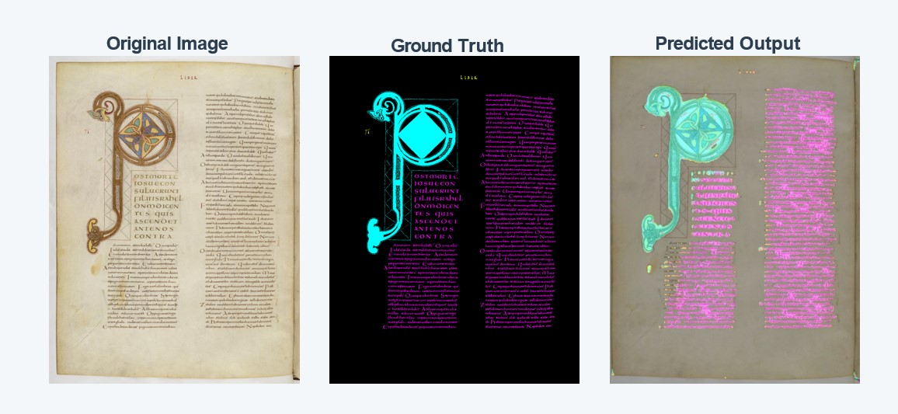

# Few-Shot Manuscript Segmentation (U-Net)

A computer vision pipeline for semantic layout analysis of historical manuscripts, trained under severe data scarcity (few-shot learning).

This repository demonstrates how to effectively train a ResNet34-backed U-Net architecture using only 3 manually annotated ground-truth images by utilizing heavy synthetic data generation and sliding-window patch inference.

## Visual Results

The following qualitative result shows the **input manuscript**, **ground truth**, and **model prediction** side by side in one figure.



> The visualization highlights how the model recovers major layout regions despite extremely limited supervision.

## Architecture & Techniques

* **Synthetic Data Forging:** Utilizes `albumentations` to generate 3,000 highly augmented training tiles (grid distortions, rotations, color shifts) from 3 base images, solving the data scarcity problem.
* **Semantic Segmentation:** Implements a U-Net architecture with a pre-trained ResNet34 backbone (`segmentation-models-pytorch`) to classify 5 distinct manuscript elements (Main Text, Titles, Decorations, Comments, Background).
* **Sliding Window Inference:** Processes massive, high-resolution test images (4K+) by utilizing a strided sliding window algorithm, avoiding the destructive downscaling typically required by memory constraints.
* **Web UI:** Includes a standalone `gradio` web application for interactive model demonstration.

## Evaluation and ICDAR 2024 Benchmark

The model is evaluated using Intersection over Union (IoU) across the validation set. Because test images exceed standard GPU VRAM constraints, evaluation is dynamically calculated using a 512x512 tiled window strategy.

**Performance Context:**
This few-shot pipeline achieves a final IoU of **43.69%**. For context regarding the complexity of this task, the 5th place submission at the ICDAR 2024 Historical Document Segmentation Challenge reported **49.10%**.

## Quick Start

### Installation
```bash
git clone https://github.com/cati3000/few-shot-segmentation.git
cd few-shot-segmentation
pip install -r requirements.txt
```
